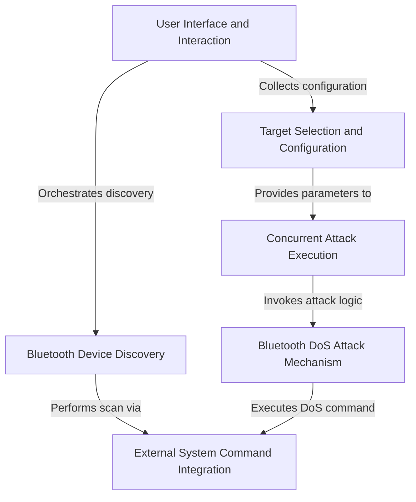

# Bluetooth-Jammer
Perform DoS Attacks on Bluetooth Devices which is Paired.

Ported & Optimized for Kali Linux by Hackwithakki

Welcome dear HACK3RS 
Make sure to join us on Telegram ! 
Visit Here -[🎭 https://t.me/hackwithakki 🎭](https://t.me/hackwithakki)

# Tutorial: Bluetooth-Jammer

This project is a **Bluetooth jammer** designed to disrupt nearby Bluetooth devices.
It allows users to *scan for available devices*, *select a specific target*, and then launch a powerful **Denial-of-Service (DoS) attack**.
By using *multiple concurrent processes* to flood the target with data packets, it aims to effectively jam and disrupt the device's Bluetooth connection.

## Visual Overview

## Chapters

1. [User Interface and Interaction
](01_user_interface_and_interaction_.md)
2. [Bluetooth Device Discovery
](02_bluetooth_device_discovery_.md)
3. [Target Selection and Configuration
](03_target_selection_and_configuration_.md)
4. [Concurrent Attack Execution
](04_concurrent_attack_execution_.md)
5. [Bluetooth DoS Attack Mechanism
](05_bluetooth_dos_attack_mechanism_.md)
6. [External System Command Integration
](06_external_system_command_integration_.md)

---
